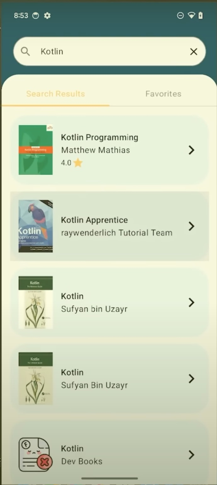
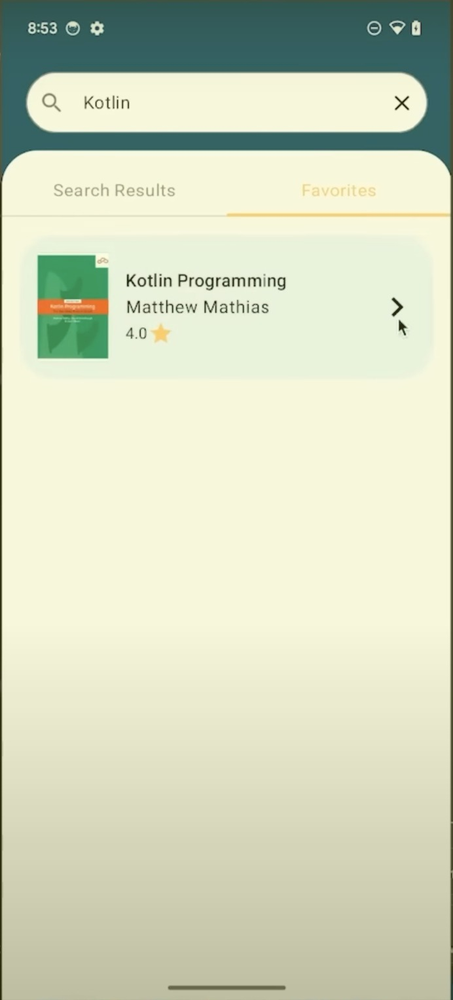

# Bookpedia

A Kotlin Multiplatform project for book cataloging and management targeting Android, iOS, and Desktop platforms.

## Overview

Bookpedia helps you organize and keep track of your book collection across multiple platforms. Built with Kotlin Multiplatform and Compose UI for a consistent experience on all devices.

## Screenshots

  
  
  

## Project Structure

- `/composeApp` is for code that will be shared across your Compose Multiplatform applications.
  It contains several subfolders:

  - `commonMain` is for code that's common for all targets.
  - Other folders are for Kotlin code that will be compiled for only the platform indicated in the folder name.
    For example, if you want to use Apple's CoreCrypto for the iOS part of your Kotlin app,
    `iosMain` would be the right folder for such calls.

- `/iosApp` contains iOS applications. Even if you're sharing your UI with Compose Multiplatform,
  you need this entry point for your iOS app. This is also where you should add SwiftUI code for your project.

## Technologies

- Kotlin Multiplatform
- Jetpack Compose
- SwiftUI for iOS-specific features
- SQLDelight for data persistence

## Getting Started

1. Clone the repository
2. Open in Android Studio or your preferred IDE
3. Run on your desired platform

Learn more about [Kotlin Multiplatform](https://www.jetbrains.com/help/kotlin-multiplatform-dev/get-started.html)…
